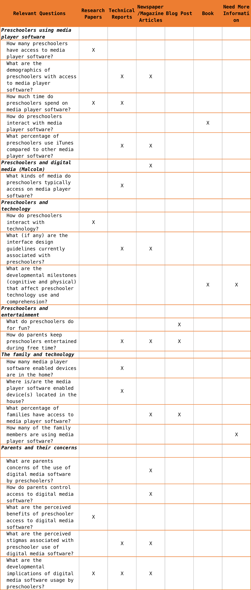
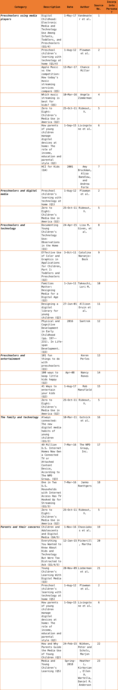
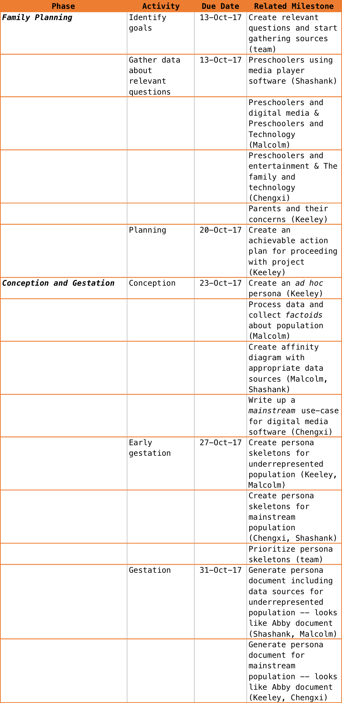

# Project Installment 2: Family Planning

**Last Updated:** *2017-10-20*
**Group Members:** *Keeley Abbott, Shashank Moghe, Malcolm Diller, and Chengxi Yang*

## Data What's: Things you need to find out from your data (as in Figure C.3)

## Data Where's: Sources you hope to read to find those things out (as in Figure C.4)

## Data When's: A schedule of the data planning/collection/organization parts of Family planning and Conception/gestation. With real dates so that you can make these deadlines. (Action Plan)

