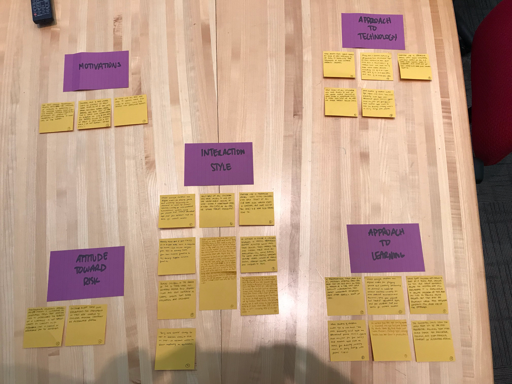

# Project Installment 3: Conception and (Early) Gestation

**Last Updated:** *2017-10-23*
**Group Members:** *Keeley Abbott, Shashank Moghe, Malcolm Diller, and Chengxi Yang*

## Conception of Underrepresented Group (team):
### Affinity Diagrams (picture of our "white board" work)

### Data Sources
| Source No. | Factoid | Attribute/Label |
|:-----------|:--------|:----------------|
| 5 | Nine-month olds spend nearly an hour a day watching television or DVDs, 5-year-olds are beginning to play with their parents' iPhones. | Approach to Technology |
| 5 | Half (52%) of all children now have access to one of the newer mobile devices at home: either a smartphone (41%), a video iPod (21%), or an iPad or other tablet device (8%) | Approach to Technology/Interaction Style |
| 5 | More than a quarter (29%) of all parents have downloaded “apps” (applications used on mobile devices) for their children to use. And more than a third (38%) of children have ever used one of these newer mobile devices, including 10% of 0- to 1-year-olds, 39% of 2- to 4-year-olds, and 52% of 5- to 8-year-olds. | Approach to Technology |
| 5 | Computer use is pervasive among very young children, with half (53%) of all 2- to 4-year olds having ever used a computer, and nine out of ten (90%) 5- to 8-year-olds having done so. | Approach to Technology/Interaction Style |
| 5 | Children age 8 and under spend an average of about three hours (3:14) a day with media, including screen media, reading, and music. Most of that time is spent with screen media: an average of 2:16 a day. Music and reading occupy an average of about a half-hour a day each (:29 for reading, :29 for music). | Motivations |
| 6 | Most younger children use digital media for playing games and watching streaming, on demand or catch-up content services – mainly for mass-produced entertainment content, since few parents had loaded educational apps, and few children had the skills for content creation. | Approach to Learning/Interaction Style |
| 7 | In the preoperational stage (ages 2 to 7), children’s attention spans are brief. They can hold only one thing in memory at a time. They have difficulty with abstractions. They cannot understand situations from other people’s points of view. | Approach to Learning |
| 7 | While some children may begin to read at a young age, designs for this age group generally assume the children are still preliterate. It is reasonable to expect children at this age can click on specific mouse targets, but they must be relatively large. Most designers generally still avoid use of the keyboard (except “hit any key” approaches). | Interaction Style |
| 8 | As outlined in Figure 4, children engaged in various technology-related activities while using their devices. They tapped the iPad screen while using an application (e.g., while playing the game Angry Birds), watched YouTube videos, looked at family photos, created digital artwork and listened to music. | Interaction Style |
| 8 | The most common technology-related activity was watching or listening to something on the computer screen (23%), although several children (13%) also responded by jumping or squealing in response to what was on the screen. | Motivation |
| 8 | Other studies of children under age eight note that “the most frequently used apps are educational games (43%...), games that are just for fun (42%), and creative apps such as those for drawing, making music, or doing things with photos (38%)”. | Approach to Technology/Approach to Learning |
| 9 | Younger children, in the range of two to three years old, generally prefer bold, primary colors and high contrasts in graphic layouts that evoke exploration and discovery. | Interaction Style |
| 9 | Young users should always be able to discern where to click or tap—or at least where to start exploring an application. | Interaction Style |
| 10 | Of those who do, most are open to letting their kids listen to music; only 22% restrict this particular activity (see Figure 11). | Motivations |
| 12 | The egocentric child views the world from his or her own perspective, assuming that other people share her feelings, knowledge, and even physical view of the world. | Approach to Learning |
| 12 | Children accept their own explanations for phenomena as they are unable to consider another viewpoint or alternative reason. | Attitude Toward Risk |
| 12 | Preoperational children’s irreversible thinking is illustrated by conservation tasks that require them to understand that the quantity of a substance is not transformed by changes in its appearance, that a change in appearance can be reversed. | Attitude Toward Risk |
| 12 | Preoperational children exhibit centration, the tendency to focus on one part of a stimulus or situation and exclude all others. | Interaction Style |
| 16 | Today it is almost unimaginable for an American child to not have a television at home. Television is ubiquitous, and so too are other media in the American home. As the price of digital technologies continues to fall, children of all ages are becoming regular consumers of digital media. Not only do more children than ever have access to digital media, they have an increasing number of choices in the types of media they can own and use. The definition of a media “platform” has blurred as it has become possible to consume media in a variety of ways. Television, for example, can be streamed via the Internet and viewed on a personal computer. Children’s books can be read on iPads. Cell phones can browse the Web, play video games, and hold a 5,000-song music collection, in addition to making calls. There is an ever-increasing menu of options in how kids access content. | Motivations |
| 19 | As content from PBS high-quality programs is translated into apps and game formats (eg, Martha Speaks, Big Bird’s Words, and Cookie Monster’s Challenge apps), educational benefits have been shown in preschoolers. | Approach to Learning |
| 20 | The statistics on how much time kids are actually spending in front of screens suggest that devices are now kids’ favorite toys. A 2014 study in the journal Clinical Pediatrics found that about half of U.S. kids ages 6 to 18 exceed the two-hour limit on recreational screen time, including 16% who spend more than four hours per day in front of a screen. The revolution is happening fast, too. According to an in-depth report on kids’ media use by Common Sense Media, the percentage of kids under age 8 with access to a smartphone or tablet at home went from 52% in 2011 to 75% in 2013—including 38% of children under 2. | Interaction Style |
| 20 | Older preschoolers may have their own devices, or more regular use of another family member’s device, to read books or play with apps. They will become more skilled and independent as they spend more time on these activities, but it is important to continue to sit with them during screen time, and draw them out with conversation about what they are doing. The temptation to hand over your device to keep a toddler occupied is strong – child media experts call this the “shut-up toy” use. On an airplane or long car trip, if you decide to let a toddler play on a device alone, select a few familiar books or games and limit access to those. Try to be part of the experience, if you can. Also bring other distractions, including printed books. Finally, explain that it’s a special arrangement, just for vacation or just for the airplane, so your child won’t expect increased screen time once the trip is over. | Interaction Style |

### Persona Skeletons
**Stevie (Preschooler)**

_Motivations and Strategies_
  - Motivations: Stevie likes to listen to music and watch videos for fun [3](#g14). Stevie's parents also let Stevie use applications that are fun ways of learning reading [5](#r11).
  - Approach to Learning: Stevie learns best when presented information in small chunks during relatively short timespans [1](#b02). Stevie processes information best when presented from Stevie's own perspective [4](#k15). Educational apps and games help Stevie to learn about the world, and start training skills like reading and math [2](#c16).
  - Attitude Toward Risk: Stevie finds it difficult to accept other points of view, including when introduced to problems that may not have been encountered already in the past [4](#k15). Stevie tends to believe once something has happened there is no way of reversing the process to recover from the action [4](#k15).

_Technology and Interaction_
  - Interaction Style: Stevie can click on objects using a mouse, or select icons using touch [7](#b02), [3](#g14). Stevie generally chooses bright colors when selecting objects to click on or icons to touch [5](#n11).
  - Approach to Technology: Stevie is very familiar with technology for watching television and DVDs, and has even had access to a mobile device at home for entertainment [6](#r11), [3](#g14). Even so, Stevie can find it confusing to be presented with too many options for entertainment at once [1](#b02).

[1] Bruckman, Amy, Alisa Bandlow, and Andrea Forte. "HCI for kids." (2002).
[2] Chassiakos, Yolanda Linda Reid, et al. "Children and adolescents and digital media." Pediatrics 138.5 (2016): e20162593.
[3] Given, Lisa M., et al. "Documenting young children's technology use: Observations in the home." Proceedings of the Association for Information Science and Technology 51.1 (2014): 1-9.
[4] Kuther, Tara L. Physical and Cognitive Development in Early Childhood (pp. 197--231). In Lifespan development: Lives in context. SAGE Publications, 2015.
[5] Naranjo-Bock, C. "Effective Use of Color and Graphics in Applications for Children, Part I: Toddlers and Preschoolers." Published 3 (2011): 2011.
[6] Rideout, V., et al. "Zero to eight children’s media use in America: Common Sense Media." (2011).

## Conception of Mainstreamer Group (team):
### Use Case for Mainstreamer
The mainstream use case for our product is an adult user. They enjoy listening to music and podcasts, or watching videos, and are familiar with most of the current software products used for these purposes. Our mainstreamers don't have any physical impairment that prevents them from operating the software normally, nor do they exhibit signs of cognitive impairments to the normal use of the software.

### Non-data Sources
1. Approach to Learning
  - some mainstreamers learn best from experiences that are then shared with cohorts.
  - some mainstreamers can learn well by simply watching a video and reproducing the results
2. Approach to Technology
  - some mainstreamers like to have the "latest and greatest" technologies available.
  - some mainstreamers enjoy taking classes online, in addition to interacting with friends socially.
  - a few mainstreamers have a personal website or blog page that they use regularly.
3. Interaction Style
  - if typing becomes too tedious, a mainstreamer may use voice messages in their place.
  - almost all mainstreamers user emojis, pictures, and/or gifs as a way to shorthand the amount of text they need to write.
4. Attitude Toward Risk
  - many mainstreamers are highly adaptive, and are willing to experiment to achieve the results they want.
  - some mainstreamers are interested in trying lots of new things.
5. Motivations
  - many mainstreamers spend several hours a day interacting with digital media.
  - almost all mainstreamers use digital media on their cellphones, PCs, and tablets.
  - some mainstreamers use digital media for educational purposes, but a lot use them strictly for entertainment.

### Persona Skeletons
**Sophia (Mainstreamer)**

_Motivations and Strategies_
  - Motivations: She spends more than 6 hours a day interacting with digital medias, including her cellphone, PC and tablets. Most of the time she uses these digital media to study her courses, including watching lecture videos, reading notes, finishing assignments. She also uses her digital media for entertainment, such as for TV series and playing music.
  - Approach to Learning: She has multiple ways of learning. Besides learning at school, she likes watch videos to learn, especially for new software. Also, she likes to share her experience with friends and learn new things from other people.
  - Attitude Toward Risk: She is adaptive and fearless to changes. She could easily learn a new skill, such as a new software. Also, she likes trying different things and find what interested her most, and will spend time on her new interests.

_Technology and Interaction_
  - Interaction Style: She prefers multiple ways to interacting with digital media, especially some direct and easy way. When she has a long conversation to send to others via message, she will send a voice. Also, she likes send pictures and emojis to express her mode.
  - Approach to Technology: She keeps in touch with the latest technology. She has a lot of social medias, enjoys learning on online courses. She even created her own website.
