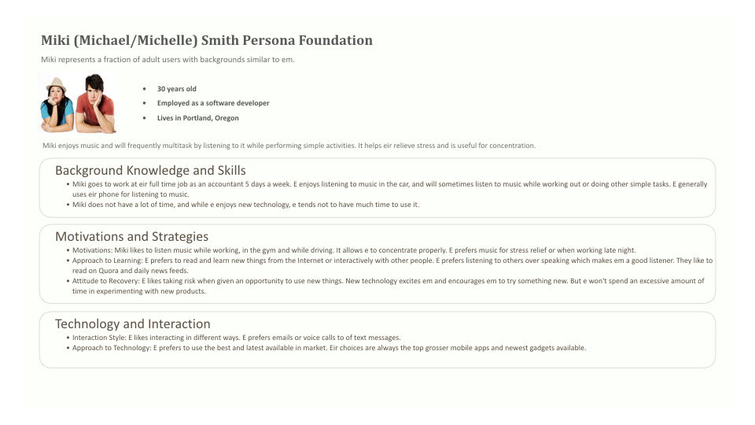

# Project Installment 4: Rest of Gestation, Concepts, Very Early Prototype

**Last Updated:** *2017-11-07*
**Group Members:** *Keeley Abbott, Shashank Moghe, Malcolm Diller, and Chengxi Yang*

## Gestation Information
### Underrepresented Population Persona

       
### Mainstreamer Population Persona

## Concepts

## Prototype

## References
1. [Bruckman, Amy, Alisa Bandlow, and Andrea Forte. "HCI for kids." (2002).](#bbf02hci)
2. [Given, Lisa M., et al. "Documenting young children's technology use: Observations in the home." Proceedings of the Association for Information Science and Technology 51.1 (2014): 1-9.](#gea14aist)
3. [Gutnick, Aviva Lucas, et al. "Always connected: The new digital media habits of young children." New York: The Joan Ganz Cooney Center at Sesame Workshop. 2011.](#gea11always)
4. [Kuther, Tara L. Lifespan development: Lives in context. SAGE Publications, 2015.](#k15lifespan)
5. [Common Sense Media, and Victoria Rideout. Zero to eight: Children's media use in America. Common Sense Media, 2011.](#v11csm)
6. [Takeuchi, Lori. "Families matter: Designing media for a digital age." New York: The Joan Ganz Cooney Center at Sesame Workshop. 2011.](#t11families)
