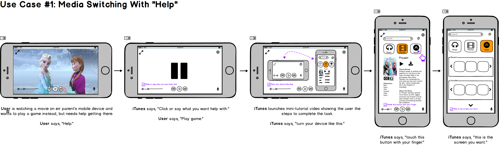
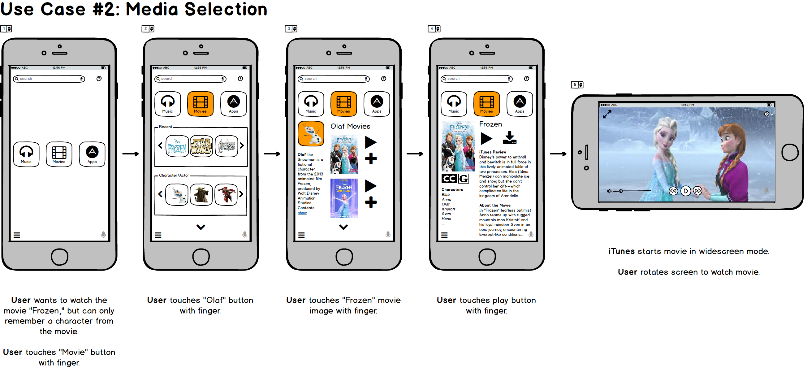
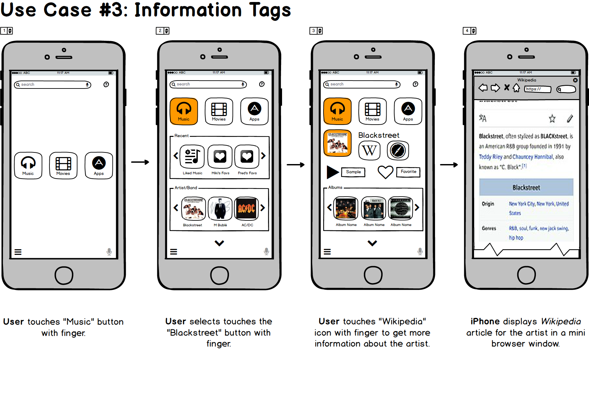

# Final Project Installment: Complete Project + Presentation Slides

**Last Updated:** *2017-11-22*
**Group Members:** *Keeley Abbott, Shashank Moghe, Malcolm Diller, and Chengxi Yang*

## Use Cases
### Underserved Population
1. Fred has been watching a movie and decides e would rather play a game. Fred doesn't quite know how to do this, so e needs some help figuring out how to stop the movie, and return to the "home" screen where e can select the apps/games menu.
2. One of Fred's parents has handed Fred their mobile device in order to keep em busy while they do something else. Fred decides e wants to watch "Frozen," but can't remember the name of the movie only "Olaf".

### Mainstreamer Population
3. Miki wants to listen to some new music that e has heard about from friends. E doesn't know much about the artist, and wants to learn more about them before listening to their music.

## Prototype
1. Included in file upload as "overviewSwitching.pdf" as well.

2. Included in file upload as "overviewSelection.pdf" as well.

3. Included in file upload as "overviewInfoTags.pdf" as well.

## Design Decision Justifications (based on personas and feedback)
### Decisions based on underserved attributes:
  1. Approach to Learning: with this attribute we included help videos that are presented from the user perspective. Each of these videos is designed to be short and limit the number of actions (for the completion of the task), in order to minimize the amount users have to remember or act upon.
  2. Approach to Technology: with this attribute, we wanted to make sure that the interface was easy to pick up if the user hadn't accessed it in a while, or if they switched technology that the interface would translate well.
  3. Attitude to Recovery: in order to keep the users from feeling like selections were "permanent" and previous state could not be recovered, we provide "paths" throughout the interface to allow users to return to an initial state or to switch to a different state easily at any time.
  4. Interaction Style: with this attribute we wanted to provide users positive feedback (icon highlighting, and positive click sounds). In addition, we provided users larger icons with more space to allow selection.
  5. Motivations: the primary design decision for this attribute was to provide users with common options they would use most often when accessing their digital media.

### Decisions based on mainstreamer attributes:
  1. Approach to Learning: to support our mainstreamer attribute, we wanted to provide additional features for learning more about screen items.

### Decisions based on feedback:
  1. During design jam #1 we received the feedback that having too many "help texts" might be distracting to a mainstream user, so we adjusted the way we were going to handle this by providing a single help button that allows for multiple outputs depending on the selection for help.
  2. During design jam #1 we received the feedback that having a single item for a category displayed (say a single playlist when you've selected "music") could be frustrating for a mainstream user, so we adjusted the number of selection to allow more visibility without feeling "overwhelming" for our underserved population.
  3. During design jam #1 we received the feedback that the attribute "Attitude Toward Risk" might be a little misleading, so we adjusted it to represent the true meaning of the attribute (Attitude to Recovery). This was based on the fact that we meant to highlight the need to include methods for representation to preschoolers that address their attitudes toward permanence.
  4. During design jam #2 we received the feedback that it should be possible for content to be filtered, so we added some setting features that would allow individual settings to be applied to different/different types of users.
  5. During design jam #2 we received the feedback that the icon on our original "movie" screen (that contained a character or the name of the movie being watched) looked too much like the other icons, and might be confusing, so we adjusted the layout to include information about the movie instead.
  6. During design jam #2 we received the feedback that we may be providing too few icons for mainstream users (that this might be limiting for them), and while we feel it is a valid concern, we also recognize that there is a trade-off here between allowing users enough information and not overwhelming other users.

## Persona Foundation Documents
### Underrepresented Population Persona
**Fred (Frederick/Frederica) Smith Persona Foundation**
_Fred represents a fraction of preschooler users with backgrounds similar to em._

- 4 years old
- Attends preschool
- Lives in Portland, Oregon

Fred really likes music, and movies and television. When e is allowed to listen to music, Fred especially likes to listen to music from eir favorite movies and television shows. Before leaving for school Fred must turn off all devices, and focus on getting ready. Media tends to distract Fred from what e is doing when it is left on as "background" noise. During the day, Fred likes to run around and play with friends -- especially outside. At night Fred's parents may allow eir to watch a quiet movie or television show to calm down before bed time.

**Background Knowledge and Skills**
- Fred goes to preschool part time (3 days a week). When e is at home, Fred is comfortable using eir parents smartphone or tablet to listen to music, watch videos, or play apps and games[2,3,5,6].
- Fred likes to use eir imagination, knows eir colors and shapes[1,4]. E also enjoys learning about letters and numbers[1,4].

**Motivations and Strategies**
- Motivations: E spends about 3 hours per day using digital media[5], and enjoys listening to music and watching movies or television[2,5].
- Approach to Learning: Fred has a short attention span[1], so tutorials for apps have be short since e can only keep small amounts of memory data at a time[4]. E has difficulty doing more than one thing at a time[1], and has trouble viewing the world from other people's perspective[4]. Because of this, e only enjoys tutorials that focus on the things e wants to learn about[4].
- Attitude to Recovery: E is generally fairly fearless, and when something goes wrong e is certain to come up with a reason for why[4]. When others try to explain to em that eir explanations may not be correct, e is usually quite stubborn and persists that eirs beliefs are correct[4].

**Technology and Interaction**
- Interaction Style: Fred enjoys apps which have large icons that are easy to click on[1,5]. E also likes bright, bold colors, with high contrast[1]. E does have a hard time clicking on smaller icons or layouts with too many of them, and e sometimes gets lost because e is too focused on one part of an app[1,4,5].

### References
1. [Bruckman, Amy, Alisa Bandlow, and Andrea Forte. "HCI for kids." (2002).](#bbf02hci)
2. [Given, Lisa M., et al. "Documenting young children's technology use: Observations in the home." Proceedings of the Association for Information Science and Technology 51.1 (2014): 1-9.](#gea14aist)
3. [Gutnick, Aviva Lucas, et al. "Always connected: The new digital media habits of young children." New York: The Joan Ganz Cooney Center at Sesame Workshop. 2011.](#gea11always)
4. [Kuther, Tara L. Lifespan development: Lives in context. SAGE Publications, 2015.](#k15lifespan)
5. [Common Sense Media, and Victoria Rideout. Zero to eight: Children's media use in America. Common Sense Media, 2011.](#v11csm)
6. [Takeuchi, Lori. "Families matter: Designing media for a digital age." New York: The Joan Ganz Cooney Center at Sesame Workshop. 2011.](#t11families)

### Mainstreamer Population Persona
**Miki (Michael/Michelle) Smith Persona Foundation**
_Miki represents a fraction of adult users with backgrounds similar to em._

- 30 years old
- Employed as an Accountant
- Lives in Portland, Oregon

Miki enjoys music and frequently multitask by listening to it while performing simple activities. It helps eir to relieve stress and is useful for concentration. E also enjoys watching the latest movies, and catching up on television shows when e can, though e has little free time to enjoy those things. At night e tries to avoid using eir devices, so e can get a good night sleep.

**Background Knowledge and Skills**
- Miki goes to work at eir full time job as an accountant 5 days a week. E enjoys listening to music in the car, and will sometimes listen to music while working out or doing other simple tasks. E generally uses eir phone for listening to music.
- Miki does not have a lot of time, and while e enjoys new technology, e tends not to have much time to use it.

**Motivations and Strategies**
- Motivations: Miki likes to listen music while working, in the gym and while driving. It allows e to concentrate properly. E prefers music for stress relief or when working late night.
- Approach to Learning: E prefers to read and learn new things from the Internet or interactively with other people. E prefers listening to others over speaking which makes em a good listener. They like to read on Quora and daily news feeds.
- Attitude to Recovery: E likes taking risk when given an opportunity to use new things. New technology excites em and encourages em to try something new. But e won't spend an excessive amount of  time in experimenting with new products.

**Technology and Interaction**
- Interaction Style: E likes interacting in different ways. E prefers emails or voice calls over text messages.
- Approach to Technology: E prefers to use the best and latest available in market. Eir choices are always the top grosser mobile apps and newest gadgets available.

## Presentation
_Included in file upload as "projectFinalInstallmentSlides.pdf"_
